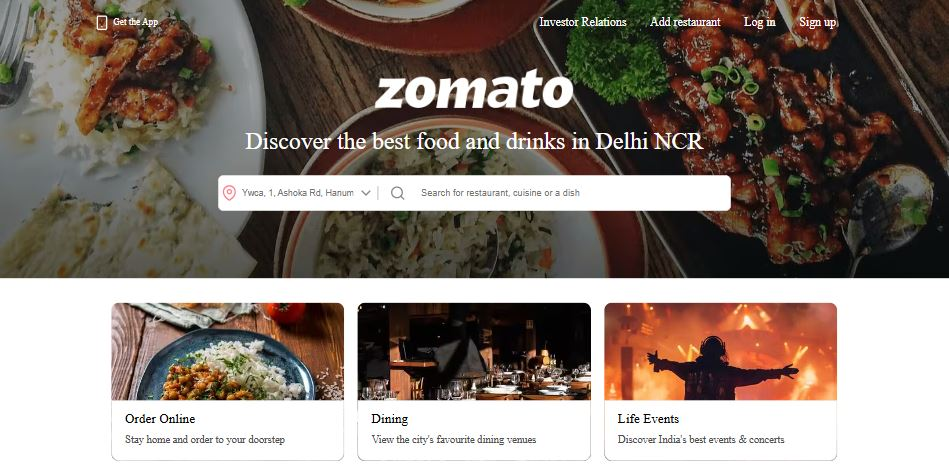
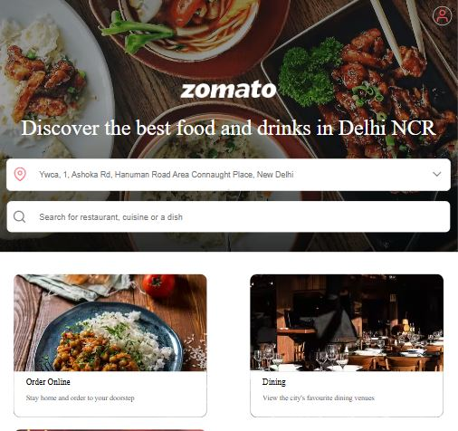
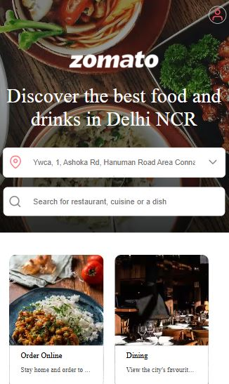

# Zomato Clone Website

This project is a **Zomato Clone Website** built using only **HTML** and **CSS**. The website replicates the design and user interface of Zomato, providing a visually appealing and functional static clone.

Zomato is a popular restaurant discovery and food delivery platform that helps users explore restaurants, read reviews, and order food online.

## Features

- **Responsive Design**: The website is designed to adapt to different screen sizes, ensuring a seamless experience on desktops, tablets, and mobile devices.
- **Navigation Bar**: Includes a fully functional navigation bar for easy access to different sections.
- **Home Page Layout**: Replicates Zomato's home page design with sections like search, featured restaurants, and promotional banners.
- **Typography**: Uses the "Open Sans" font, a close alternative to Zomato's proprietary "Okra" font.
- **Static Pages**: Includes static pages for exploring restaurants, viewing offers, and other features.

## Technologies Used

- **HTML**: For structuring the content of the website.
- **CSS**: For styling and layout.

## Folder Structure

```
Zomato-Clone/
├── index.html              # Main HTML file
├── assets/
│   └── images/            # Contains images used in the project
├── scripts/
│   └── accordion.js       # JavaScript for accordion functionality
├── styles/
│   ├── app.css           # Main styles
│   ├── collections.css   # Styles for collections section
│   ├── explore.css       # Styles for explore section
│   ├── footer.css        # Styles for footer
│   ├── index.css         # Styles for index page
│   ├── localities.css    # Styles for localities section
│   ├── main.css          # Global styles
│   ├── nav.css           # Styles for navigation bar
│   ├── options.css       # Styles for options section
│   └── top.css           # Styles for top section
└── README.md              # Project documentation
```

## How to Run the Project

1. Clone the repository or download the project files.
2. Open the `index.html` file in any modern web browser.

## Fonts and Design

- The project uses the **Open Sans** font, imported from Google Fonts, as a substitute for Zomato's "Okra" font.
- To ensure consistency with Zomato's design, the color palette, spacing, and typography have been carefully matched.

### Adding the Font
Include the following in the `<head>` section of your HTML file to use Open Sans:

```html
<link href="https://fonts.googleapis.com/css2?family=Open+Sans:wght@400;600;700&display=swap" rel="stylesheet">
```

## Screenshots

### Home Page (Top Section)

#### Desktop View


#### Tablet View


#### Mobile View


## Limitations

- This is a static website and does not include backend functionality such as user authentication, restaurant data fetching, or dynamic content updates.
- Some advanced animations and effects may not be fully replicated due to the use of only HTML and CSS.

---

Happy coding! 🎉
